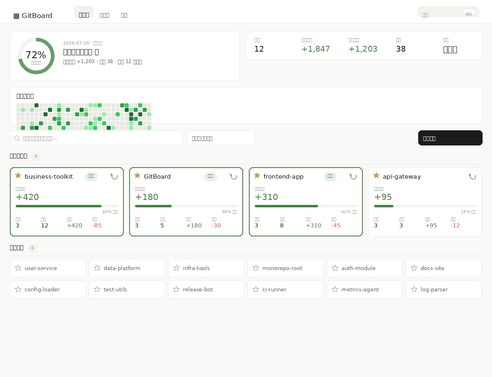
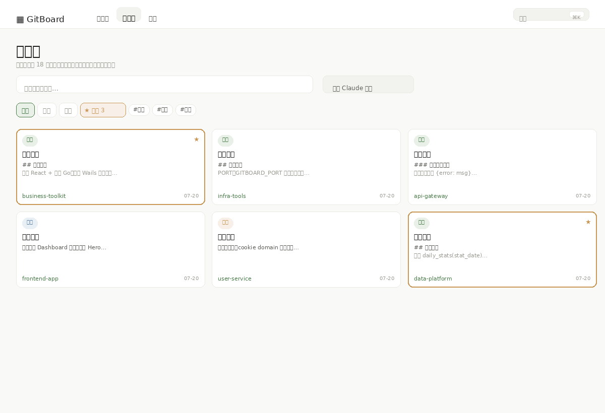
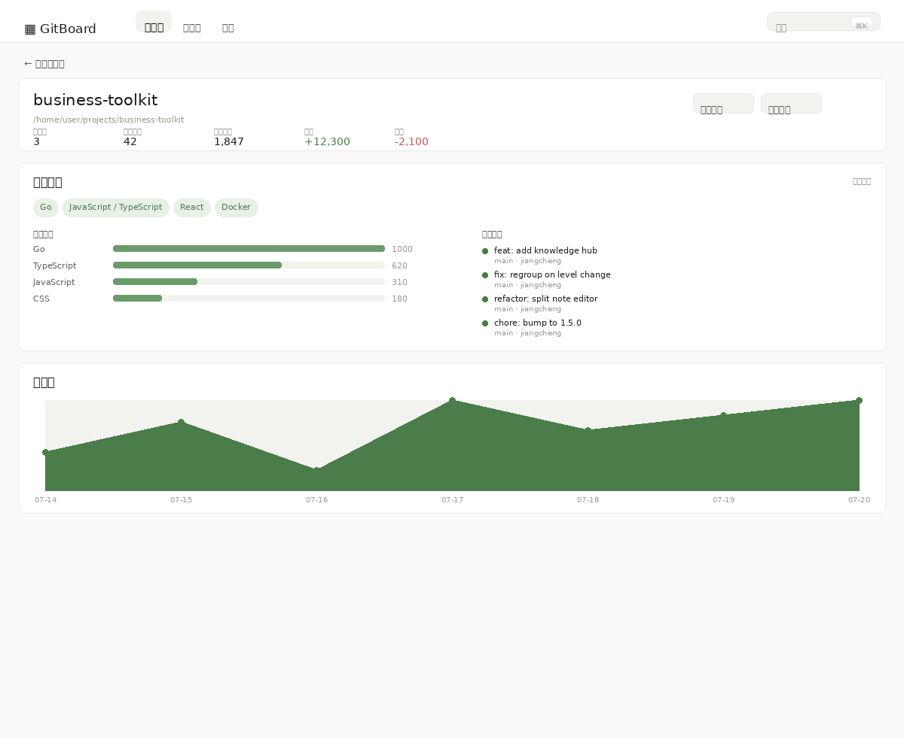

# GitBuddy

自动发现本地所有 Git 仓库，以可视化 Web 面板独立展示每个项目的每日代码提交量。

[](https://go.dev)
[](https://react.dev)
[](https://web.dev/progressive-web-apps/)
[](./LICENSE)

## 截屏预览







> 截图为示意渲染（由 `scripts/generate_screenshots.py` 生成），实际界面以应用为准。

## 功能特性

| 特性 | 说明 |
|------|------|
| 自动发现仓库 | 设置扫描根目录后递归发现所有 Git 仓库，平台自适应默认规则；扫描仅登记仓库名，不预扫历史 |
| 可视化仪表盘 | 每日目标进度环突出「我达标了吗」；项目卡片、趋势折线图、提交热力图 |
| 仓库收藏 | 已收藏仓库展示完整统计卡片；未收藏仓库仅显示名称与收藏按钮，按需关注 |
| 按需刷新历史 | 已收藏仓库卡片提供「刷新历史记录」按钮，点击后才回填该仓库近 365 天的每日统计数据 |
| 模糊搜索 | 顶部搜索框支持仓库名称/路径模糊搜索，并在结果中直接切换收藏状态 |
| 智能项目分组 | 自动识别 Monorepo 与单仓库，支持手动拆分/合并（事务安全，笔记与待办随项目迁移） |
| 工作日检查 | 自定义每日代码量标准，未达标时面板告警提醒 |
| 知识库 | 跨项目笔记中心：Markdown 笔记、标签、置顶、分类；全文搜索（排序 + 片段高亮，跨笔记与待办） |
| 知识库体验增强 | 首屏搜索框自动聚焦；顶部「最近编辑」快速访问区（最多 5 条）；空状态引导创建或导入 AI 记忆；编辑器「关联项目」下拉快速迁移笔记 |
| 仓库知识挖掘 | 自动提取 README、检测技术栈与语言占比、最近提交流，缓存避免重复扫描 |
| 命令面板 | ⌘/Ctrl+K 快速搜索笔记/待办并跳转项目 |
| Claude 记忆导入 | 一键将 `~/.claude/projects/*/memory/*.md` 安全导入为知识笔记（参数化查询，幂等） |
| 跨平台单文件 | Go 编译为单个二进制，无运行时依赖，双击即用 |
| PWA 可安装 | 支持安装到桌面/主屏幕，获得原生应用体验 |

## 快速开始

### 下载安装

从 [Releases](https://github.com/sky-jiangcheng/gitbuddy/releases) 下载对应平台的最新版本。

| 平台 | 一键安装 |
|------|---------|
| macOS / Linux | `curl -fsSL https://raw.githubusercontent.com/sky-jiangcheng/gitbuddy/master/scripts/install.sh \| bash` |
| Windows | `iwr -useb https://raw.githubusercontent.com/sky-jiangcheng/gitbuddy/master/scripts/install.ps1 \| iex` |

### 手动使用

```bash
# 下载后赋予执行权限
chmod +x gitboard

# 直接运行
./gitboard
```

启动后自动打开浏览器访问 `http://localhost:18731`，进入仪表盘。

### 配置

首次启动使用平台默认扫描规则：

| 平台 | 默认扫描范围 |
|------|-------------|
| Windows | 除系统盘(C:)外的所有磁盘根目录 |
| macOS | 当前用户 HOME 目录 |
| Linux | 当前用户 HOME 目录 |

在设置页面可修改扫描目录、代码量标准（默认 500 行/工作日）、扫描深度（1-2级，默认 2 级）。

配置存储在应用数据目录下的 `gitboard` 文件夹中：

- **Windows**: `%APPDATA%/gitboard/dashboard.db`
- **macOS**: `~/Library/Application Support/gitboard/dashboard.db`
- **Linux**: `~/.config/gitboard/dashboard.db`

> 注意：数据库文件名为 `dashboard.db`。若你从早期版本升级，schema 会自动迁移（结构化笔记字段、知识挖掘缓存表等）。

## 从源码构建

**前置要求**：Go 1.23+、Node.js 18+

```bash
# 安装前端依赖
cd web && npm install && cd ..

# 构建前端（编译为静态资源）
cd web && npm run build && cd ..

# 编译 Go 二进制（前端静态资源自动 embed）
go build -ldflags="-s -w" -o gitboard .

# 或使用构建脚本
bash scripts/build.sh
```

### 开发模式

```bash
# 终端1: 启动后端开发服务器
go run . -dev

# 终端2: 启动前端热更新开发服务器
cd web && npm run dev
```

前端开发服务器 `http://localhost:5173` 会将 `/api` 请求代理到后端 `http://localhost:18731`。

## 项目分组规则

GitBuddy 使用智能分组算法自动识别项目边界：

| 场景 | 分组规则 |
|------|---------|
| 单仓库项目 | 父目录包含唯一仓库 -> 父目录即为项目 |
| MonoRepo | 父目录包含多个子仓库 -> 归为一个项目 |
| 嵌套仓库 | 父目录本身是 Git 仓库，其子目录也有仓库 -> 拆分为两个独立项目 |

通过设置页面的「项目分组级别」调整键，可以手动将整个父目录提级或将其子仓库拆分为独立项目。

## 前后端接口

GitBuddy 是 Wails 桌面应用：Go 方法通过 Wails Bind 直接暴露给前端（`window.go.main.App.*`），开发模式下（`npm run dev`）前端通过 `/api` HTTP 代理回退访问同一逻辑。主要绑定方法：

| 方法 | 说明 |
|------|------|
| `GetProjects(date, starredOnly)` | 项目列表，支持按日期与关注过滤 |
| `GetProjectDetail(id)` | 项目详情（仓库列表与历史统计） |
| `GetProjectOverview(id)` | 仓库知识挖掘（README/技术栈/语言/最近提交） |
| `GetSummary(date)` | 全局摘要统计 |
| `GetHeatmapData()` | 近一年提交热力图 |
| `UpdateProjectLevel(id, direction)` | 拆分（down）/合并（up）项目分组 |
| `ToggleStar(id)` | 切换仓库收藏状态 |
| `RefreshProjectHistory(id)` | 按需回填单个已收藏仓库近 365 天的每日统计 |
| `SearchProjects(query)` | 按仓库名称/路径模糊搜索 |
| `SearchNotes(query)` / `SearchAll(query)` | 笔记搜索 / 跨笔记与待办搜索（排序 + 片段） |
| `ListAllNotes()` / `ListAllTags()` | 知识库：全部笔记与标签 |
| `CreateNoteWithMeta` / `UpdateNoteMeta` / `PinNote` | 笔记元数据（标题/标签/类型/置顶） |
| `MoveNote(noteID, projectID)` | 将笔记迁移到其他项目（关联项目快捷操作） |
| `ImportClaudeMemory()` | 导入 Claude 记忆为知识笔记（经插件运行时） |
| `GetPluginStatuses()` | 插件加载状态列表 |
| `GetKnowledgeSources()` | 已注册知识导入源列表 |
| `TriggerKnowledgeImport(name)` | 触发指定知识源导入 |
| `ReloadPlugins()` | 重新扫描并加载插件目录 |
| `TriggerScan()` / `GetScanStatus()` | 扫描与状态（区分扫描中/回填历史中） |

 错误以 Go `error` 形式返回，前端按需展示。

## 插件

GitBuddy 支持进程内插件（详见 `docs/adr/0002-c-end-repositioning.md`）。插件是放置在配置目录 `plugins/` 下的 Go 脚本，启动时由 yaegi 解释器加载（跨 Win/Mac/Linux 一致，见 issue #33 选型验证）。

### 插件目录

- macOS/Linux: `~/.config/gitboard/plugins/`
- Windows: `%AppData%\gitboard\plugins\`

每个插件目录包含一个 `plugin.go`，导出以下符号：

| 符号 | 签名 | 必填 |
|------|------|------|
| `Name` | `func() string` | 是 |
| `Init` | `func(ctx *plugin.Context) error` | 是 |
| `Source` | `func() string` | 否（默认 `Name()`） |
| `Import` | `func(ctx *plugin.Context) ([]plugin.ImportDoc, error)` | 否（知识源） |

脚本通过 `import "gitboard/internal/core/plugin"` 使用宿主导出的类型。示例见 `examples/plugins/`。

### 内置知识源

Claude 记忆导入已重构为内置 `KnowledgeImporter`（issue #35），与脚本插件共享运行时导入/去重/统计路径。设置页「插件」tab 可查看插件加载状态、知识源列表并手动触发导入。

### 导入触发

- **手动**：设置页「插件」tab 点击知识源的「立即导入」
- **自动**：应用启动时自动导入所有知识源（设置页可开关 `auto_import`）
- **结果通知**：导入完成后前端弹出 toast 展示新增/更新/跳过数量（Wails 事件 `import.completed`）

### 运行时行为

- 插件 panic 不会崩溃宿主进程：运行时 `recover` 并记录错误到设置页
- 插件目录不存在时静默跳过
- 事件总线：`note.created` / `project.scanned` / `import.completed`
- 导入幂等：按 `(project, source, title)` 去重，重复导入更新而非复制

## 技术栈

| 层 | 技术 |
|----|------|
| 桌面框架 | Wails v2（Go 后端方法直绑前端） |
| 后端 | Go + SQLite (modernc.org/sqlite，零 CGO) |
| 前端 | React 18 + TypeScript + Vite + Chart.js |
| PWA | vite-plugin-pwa + Workbox |
| 构建 | GitHub Actions 自动发布 Win/Mac/Linux 二进制 |

## 项目结构

```
├── main.go              # Go 程序入口，启动编排和优雅退出
├── app.go               # Wails 绑定方法（项目/笔记/知识/扫描等）
├── internal/
│   ├── platform/        # 平台检测、浏览器打开、默认扫描规则
│   ├── db/              # SQLite 表结构、版本化迁移与数据 CRUD
│   ├── scanner/         # Git 仓库递归扫描（深度/数量限制）
│   ├── stats/           # git log --shortstat 解析、最近提交
│   ├── grouper/         # 智能项目分组（Monorepo 识别、级别调整）
│   ├── knowledge/       # 仓库知识挖掘（README / 技术栈 / 语言占比）
│   ├── core/plugin/     # 插件接口定义 + yaegi 脚本运行时（目录扫描/事件总线/导入）
│   └── importers/       # 内置知识导入器（claude：Claude 记忆导入）
├── examples/plugins/    # 插件示例（hello / importer）
├── web/                 # React SPA 前端（Vite + PWA）
│   └── src/
│       ├── pages/       # Dashboard（已收藏/其他仓库分区展示、模糊搜索）/ ProjectDetail / Knowledge / Settings
│       ├── components/  # ProjectCard（收藏状态切换、按需刷新历史）/ SummaryBar / GoalRing / Heatmap
│       │                 # / TrendChart / NoteSection / TodoSection / CommandPalette
│       ├── api/         # 双模式 API 客户端（Wails 绑定 + HTTP 回退）
│       └── utils/       # 主题、Markdown 渲染
├── docs/                # GitHub Pages 落地页（产品介绍）
├── scripts/             # 构建和安装脚本
└── .github/workflows/   # 多平台构建发布 + Pages 部署
```

## 安全设计

- **命令注入防护**：stats 引擎对 `date`、`author`、`branch` 参数进行正则格式校验，防止非法值传入 `git log` 命令行
- **请求体大小限制**：API 层限制请求体最大 1MB，防止内存耗尽
- **错误信息脱敏**：客户端返回统一错误消息，内部错误详情仅记录到服务端日志
- **配置键白名单**：`PUT /api/config` 仅允许 `daily_code_standard` 和 `scan_depth` 两个键的写入
- **URL 校验**：`OpenBrowser` 仅接受 `http://` 和 `https://` 协议的 URL
- **扫描边界控制**：扫描深度上限 2 级、目录数量上限 10000，防止遍历拒绝服务

## 常见问题

### Q: 仪表盘显示「暂未发现仓库」？

确保 Git 已安装且在 PATH 中，然后在设置页面配置包含 Git 仓库的扫描根目录，点击「重新扫描」。首次扫描仅登记仓库名，不会预扫历史提交数据。

### Q: 仓库卡片为什么只显示名称？

GitBuddy 采用按需扫描策略：未收藏的仓库仅展示名称与收藏按钮，不加载统计数据。点击星标收藏后，卡片将展示完整的每日统计信息。此设计避免对大量未关注仓库进行无意义的历史扫描。

### Q: 统计数据显示为零？

已收藏仓库的统计数据需要在卡片上点击「刷新历史记录」按钮触发回填（近 365 天）。点击后系统会扫描该仓库的 git log 并写入数据库，完成后卡片自动刷新。未收藏仓库不会扫描历史。

### Q: 如何快速找到某个仓库？

使用顶部的搜索框，支持按仓库名称或路径模糊搜索，搜索结果中可直接点击星标切换收藏状态，无需进入详情页。

### Q: 如何调整项目分组？

如果多个仓库被错误地归为一个项目（例如 Monorepo 识别不准确），进入项目详情页使用「级别调整」按钮提升或降低分组级别。

### Q: 端口被占用怎么办？

设置环境变量 `PORT=自定义端口` 后启动，或直接修改 `defaultPort` 常量重新编译。


