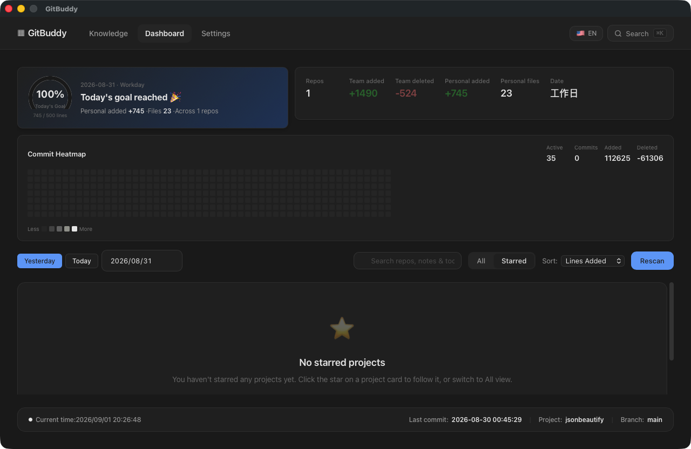

# 仪表盘

仪表盘展示所有项目的每日提交统计、目标进度与全年提交热力图。

## 页面结构（自上而下）

### 目标进度区

- **进度环**：今日（或所选日期）个人新增行数 vs 每日目标；非工作日不显示目标
- **副标题**：距达标差值、个人新增 / 文件数 / 涉及仓库数
- **摘要条**：团队新增 / 删除、个人新增 / 文件、待办总数

### 提交热力图

近 52 周每日提交密度（GitHub 风格），点击任意格子跳转到该日期查看当天项目数据。统计范围跟随当前 git 作者（设置 → 作者配置）。

### 控制区

- **日期切换**：昨天 / 今天 / 任意日期
- **联合搜索框**：实时搜索仓库、笔记与待办（防抖 300ms，结果可直接星标或跳转）
- **过滤器**：全部 / 仅收藏
- **排序**：名称 / 个人新增 / 文件数 / 仓库数
- **重新扫描**：两击确认后触发异步扫描，进度实时展示，完成后自动刷新数据

### 项目网格

- **已收藏仓库**：完整统计卡片（今日新增、目标进度条、仓库/文件/新增/删除、净增、团队总量、待办与笔记角标）
- **其他仓库**：极简卡片（名称 + 星标按钮），需要时再收藏展开

## 功能详解

### 仓库收藏

点击星标收藏仓库：卡片展开为完整统计，出现 **刷新历史** 按钮（按需回填近 365 天数据）。取消收藏立即折叠为极简卡片。

### 目标进度

**设置 → 代码标准** 配置每日目标行数（默认 500，范围 100-10000）。

- 进度环与卡片目标条显示完成度，达标显示 🎉
- 工作日未达标时卡片显示「未达标」告警；周末不告警

### 项目分组

自动按父目录分组（Monorepo 识别），手动拆分/合并见[项目详情](project-detail.md)。

## 截图

