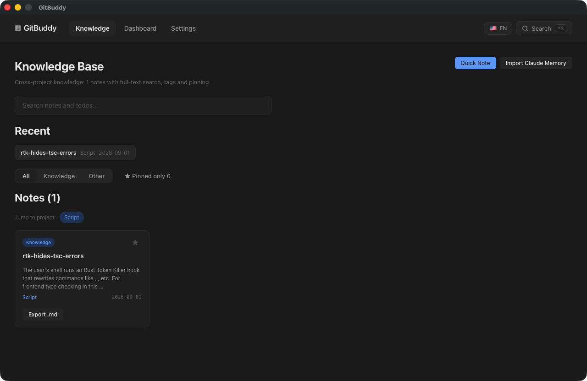

# 知识库

知识库是跨项目的笔记中心，支持 Markdown 编辑、标签分类、全文搜索与历史版本。

## 功能

### 笔记管理

- **创建笔记**：关联到指定项目，支持 Markdown 内容
- **标签**：以逗号分隔的标签，用于分类与筛选
- **类型**：`knowledge`（知识）/ `log`（日志）/ `idea`（想法）/ `other`（其他）
- **置顶**：置顶笔记在列表顶部优先展示

### 搜索

- 顶部搜索框自动聚焦，支持关键词模糊搜索
- 基于 FTS5 全文索引，按 bm25 相关性排序
- 搜索片段自动高亮匹配关键词
- 支持跨笔记与待办联合搜索（命令面板）

### 导入 Claude 记忆

一键将 `~/.claude/projects/*/memory/*.md` 安全导入为知识笔记。可在 **设置 → 插件** 页面查看导入源并手动触发。

### 笔记版本历史

每次保存笔记自动创建版本快照（最多保留 50 个版本）。在笔记卡片上点击 **历史** 按钮：

- 查看版本列表（时间、标题）
- 对比差异（LCS 行级 diff，显示新增/删除行）
- 回滚到任意历史版本

### 导出笔记

点击笔记卡片上的 **导出** 按钮，将笔记以 Markdown 格式复制到剪贴板（含 frontmatter：标题、标签、项目、类型）。

## 使用技巧

- 使用 `⌘/Ctrl + K` 打开命令面板，快速搜索并跳转笔记
- 编辑时支持 Markdown 预览实时切换
- 笔记可迁移到其他项目（在编辑界面选择「关联项目」下拉框）

## 截图

