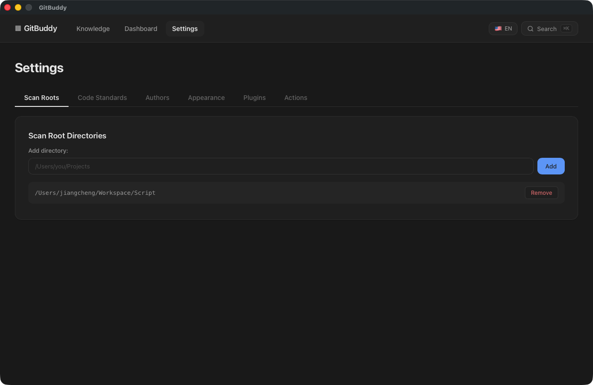
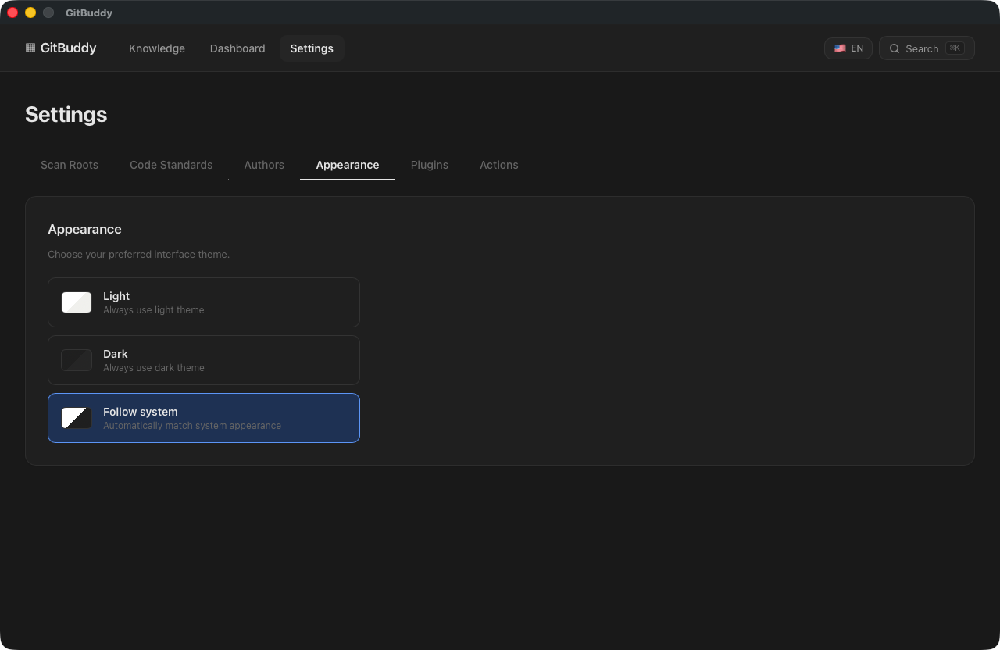

# 设置

设置页分六个标签页：扫描目录、代码标准、作者配置、外观、插件、操作。

## 扫描目录

- 添加 / 移除扫描根目录（保存后需重新扫描生效）
- 首次启动自动播种的默认根目录见[快速开始](../getting-started.md)

## 代码标准

| 配置 | 说明 | 默认 |
|------|------|------|
| 每日目标行数 | 工作日达标线，进度环与卡片告警依据 | 500（范围 100-10000） |
| 最大扫描深度 | 扫描根向下的目录层级 | 2（范围 1-2） |

## 作者配置

**git 作者名称**：个人统计的过滤作者（与 `git log --author` 一致）。未配置时自动读取 `git config user.name`。

## 外观

浅色 / 深色 / 跟随系统 三选一，即时生效并记忆。

## 插件

- **自动导入开关**：启动时是否自动运行所有知识源导入
- **已加载插件**：各插件目录的加载状态与错误信息，**重新加载** 按钮热重载
- **知识导入源**：内置（Claude 记忆）与插件注册的导入器，可单独 **立即导入**

插件开发见[插件手册](../plugins/overview.md)。

## 操作

- **立即重新扫描所有项目**：触发全量扫描（与仪表盘按钮等价）
- **导入 Claude 记忆**：手动触发一次导入，完成后可跳转知识库查看
- **安装到桌面**：将 GitBuddy 作为 PWA 安装（独立窗口 + 离线）

## 截图

